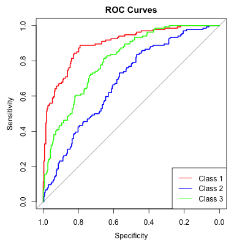
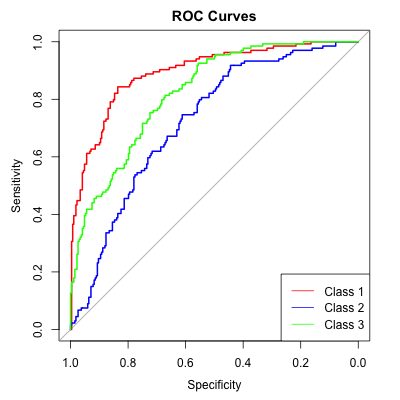

```{=tex}
\pagenumbering{gobble}
\newpage
\pagenumbering{arabic} 
\centering
\raggedright
\newpage
```

------------------------------------------------------------------------

```{r setup, include=FALSE, cache=TRUE}
params <- list(html=knitr::is_html_output())
knitr::opts_chunk$set(echo = params$html)
rm(list = ls(all.names = TRUE)) # reset the environment
set.seed(0)  # set the seed
#names(RISK)

source("Setup.R")
```

### 1. Introduction

Our general idea was to work with LGBT-related data. This was not as easy as expected, since it seems there are not a lot of datasets openly available that have that kind of information. Finally, we found a US survey by the CDC, that regularly monitors the country's youth in a lot of dimensions, but among other questions also asks for sexual experiences and identification.

### 2. The Dataset

\
"The [*Youth Risk Behavior Survey (YRBS)*](https://www.cdc.gov/healthyyouth/data/yrbs/data.htm) measures health-related behaviors and experiences that can lead to death and disability among youth and adults.[...] Some of the health-related behaviors and experiences monitored are:

-   Student demographics: sex, sexual identity, race, ethnicity, and grade

-   Youth health behaviors and conditions: sexual, injury and violence, bullying, diet and physical activity, obesity, and mental health, including suicide

-   Substance use behaviors: electronic vapor product and tobacco product use, alcohol use, and other drug use

-   Student experiences: parental monitoring, school connectedness, unstable housing, and exposure to community violence [[1]](#1).

It is a national survey conducted by the CDC (Center for Disease Control and Prevention) and includes high school students from both private and public schools within the U.S. Data is collected from 1991 through 2021, we are only using the most recent data from 2021. If you want to learn more about the data there is an accompanying Data User Guide.[[2]](#2).

#### 2.1 Preprocessing of the dataset

\


To preprocess the dataset, we first ran a summary of our dataset. The number of NAs seems to depend very much on the question. The variable "orig_rec" only contained NAs and has therefore been removed, as well as the variable "site" which only contained "XX" entries. Variables q4 and q5 are already aggregated in "raceeth" and have also been deleted. The variable "record" seems to be an ID for the observations. This also has to be deleted since IDs do not hold predictive information that can be used for machine learning.

#### 2.2 Missing Data

\

```{r variables overview, include =FALSE}
na_ratio<-sum(is.na(RISK)==TRUE)/(dim(RISK)[1]*dim(RISK)[2])# ratio of NAs among all datapoints
print(na_ratio*100) # % percentage of NAs in data
sum(is.na(RISK)==TRUE) # sum of NAs in dataset
```
We will first exclude all the observations with NAs in all the target-related variables q25 to q29. Since we want to build our target variable on these questions, the target variable cannot all be empty. Since our target variable will be a score indicating the risk of suicide among teenagers, unfortunately it is probably not helpful for any relevant application of our Machine Learning model to define a specific missing category for the NAs related in the target variable, as discussed in the lecture.
\
The amount of data available should be enough to just exclude these observations. After removing the observations that have NAs in all the variables, that are used to create our target variable, we still have around 13.7% NAs in the dataset.
\
What if we had just excluded every NA in the dataset? We will try and see if this is a viable option, since this woul not just be quick and easy, but we would also just have "real" answers. The exclusion of NAs leads to a severe reduction in the number of observations. The original data consisted of 17232 observations, if we reduce the target-related NAs only, we have 11753 observations left. If we omit all NAs, the reduced dataframe has 4334 observations.
\

```{r check exclude NAs, include=FALSE, cache=TRUE}
RISK_no_NAs <- na.omit(RISK)
summary(RISK_no_NAs)
```

In this case need to assess the loss of information foremost about our target variable. The important question is if there is a pattern to the missingness in our data, not just, but especially about our target variable.

```{r Tables for Missingness in q28, include=FALSE, cache=TRUE}
table(RISK_no_NAs$q28)
table(RISK$q28)

table(RISK_no_NAs$q28)/4334
table(RISK$q28)/17138
sum(is.na(RISK$q28)==TRUE)/17138
```

#### 2.2.2 Discussion on omitting NAs vs data imputation for the target variable

\
If we can omit the NAs or if it may be necessary to impute the missing data points, in general depends on the type of missingness. If data is missing completely at random (MCAR), we can omit the NAs, if it is just missing at random (MAR) we would rather impute the data. If the data is missing not at random (MNAR), it would be a quite difficult problem because we cannot easily impute the missing data then. To find out if we can just omit the data without introducing any bias, an MCAR test was applied. 
\
We test the target-related variables q25 to q29 for potential pattern(s) in the target related missing data. This results in a p-value of 0, which indicates, that the data is not missing completely at random. Omitting all NAs can be problematic and lead to bias.
\
But imputing the target variable related data may be an arguable choice and quite challenging to do well. We therefore decide to use the information at hand to decide for a class of the target variable, starting with the most severe question (q29 to q25). This means we check if q29 ("If you attempted suicide...") was answered positively. If yes, we use the answer for the labeling, if not, we check the next less severe question to base our choice of class label on and so on. This means that NAs are treated similar than answering negatively to the question. We hope to introduce less bias this way. 


```{r MCAR test for target columns, cache=TRUE}
result <- mcar_test(RISK[, c("q25", "q26", "q27", "q28", "q29")])
print(result)
```

```{r analyse missingness, include=FALSE, cache=TRUE}
plot_missing(RISK[1:20])
plot_missing(RISK[20:40])
plot_missing(RISK[40:60])
plot_missing(RISK[60:80])
plot_missing(RISK[80:100])
plot_missing(RISK)
```

We will use a rule base approach as described to create the target variable and impute the predictive variables afterwards. To ensure a good imputation, we need to impute our NAs before reducing the dataset to 2000 observations. To run the imputation properly we need to factorize our nominal and ordinal variables first.
\

#### 2.3 Target Variable

\

As a target variable, we decided to calculate a score from 5 questions that reflect the suicide risk of the person (observation) in question. This score is aggregated with a rule-based approach.

```{r creating the target variable, include=FALSE, cache=TRUE}
RISK_num<-RISK
RISK_num$q25 <- as.numeric(RISK_num$q25)
RISK_num$q26 <- as.numeric(RISK_num$q26)
RISK_num$q27 <- as.numeric(RISK_num$q27)
RISK_num$q28 <- as.numeric(RISK_num$q28)
RISK_num$q29 <- as.numeric(RISK_num$q29)

# TODO: think about reducing to 3 classes 
RISK_s3 <- RISK_num 
RISK_s3$suicidal_class <- ifelse(RISK_s3$q29 > 1, 3,
                          ifelse(RISK_s3$q28 > 1, 3, 
                          ifelse(RISK_s3$q27 == 1, 3,
                          ifelse(RISK_s3$q26 == 1, 3,
                          ifelse(RISK_s3$q25 == 1, 2,
                                                  1)))))

RISK_s5 <- RISK_s3 %>% 
  mutate(suicidal_class = ifelse(q29 > 1,   5, # 3
                          ifelse(q28 > 1,   5, # 3
                          ifelse(q27 == 1,  4, # 3
                          ifelse(q26 == 1,  3, # 2
                          ifelse(q25 == 1,  2,
                                            1))))))

# delete the columns from which the target variable was constructed
RISK_s3[, c("q25", "q26", "q27", "q28", "q29")] <- NULL
RISK_s5[, c("q25", "q26", "q27", "q28", "q29")] <- NULL

# removing the columns related to the target variable
RISK_s3 <- RISK_s3[!is.na(RISK_s3$suicidal_class), ]
RISK_s5 <- RISK_s5[!is.na(RISK_s5$suicidal_class), ]

#factorize the target variable
RISK_s3$suicidal_class<-factor(RISK_s3$suicidal_class, ordered = TRUE)
RISK_s5$suicidal_class<-factor(RISK_s3$suicidal_class, ordered = TRUE)


```

After creating the target variable we need to exclude the variables q25 to q29, which were used for creating it, from our dataset. After originally starting with 5 classes (no risk, low risk, moderate risk, high risk, very high risk) for our target variable we reduced it to 3 classes (no risk, low or moderate risk, high risk).

#### 2.4 Imputation


```{r imputing, include= FALSE, cache=TRUE}
set.seed(0)
# the categorical variables are factorized in the setup.R file
RISK_imp_s3 <- missRanger(RISK_s3, pmm.k = 200, num.trees = 500, sample.fraction = 1)
#write_csv(RISK_imp_s3, "RISK_imp_s3.csv")
```

\

For the imputation of the missing data, we used a random forest approach with 500 trees and a predictive mean matching with observed values of 200 similar cases.

#### 2.5 Reducing and balancing the dataset to 2000 observations

\

We need to reduce our data to the maximum allowed size of 2000 observations. To ensure the best possible data quality, we want to balance our dataset. We therefore use stratified sampling to create a dataset, that has the same number of observations for all classes of the target variable.

```{r stratified sampling, include=FALSE, cache=TRUE}
# this code snipped was produced with the help of AI
# *

set.seed(0)  # set the seed
RISK_imp_s3 <- read_csv("RISK_imp_s3.csv")
size_per_class <- rep(666, times = 3) # 400 samples from each of 5 classes, adjust as needed
sample_obj <- strata(RISK_imp_s3, stratanames = "suicidal_class", size = size_per_class, method = "srswor")
RISK_2000_3 <- getdata(RISK_imp_s3, sample_obj)
#write_csv(RISK_2000_3, "RISK_2000_3.csv")

# *
# clean up:
# rm(RISK, RISK_imp_num, RISK_imp, sample_obj, strat_df)  # remove unnecessary variables in the environment

```

#### 2.6 Simple Synopsis of the Dataset

```{r RISK_2000_5 load and inspect, include=FALSE, cache=TRUE}
source("Setup_RISK.R")

variable_types <- skim(RISK_2000_3) # get the variable types
summary(variable_types) # summary on variable types
# run lines below separately again to show: (command+enter)
table(variable_types$factor.ordered) # summary on factor variables
variable_types[variable_types$skim_type=="numeric",]
# introduce(RISK_2000_3)
```

\

-   number of observations: 2000

-   number of variables: 100

-   datatypes:

    -   factor: 96

        -   nominal variables: 29

        -   ordinal variables: 67

    -   numeric variables: 4

        -   discrete variables: 96 (here all factor variables)

        -   continuous variables: 4 (here all numeric variables)

### 3. Additional Data Preparation

\

```{r check for constant or near zero variance features and eliminate them, include=FALSE, cache=TRUE}

# ** this codeblock was done using AI **
# check if there are constant features
constantFeatures <- sapply(RISK_2000_3, function(x) {
    if(is.factor(x) || is.character(x)) {
        return(length(unique(x)) == 1)
    } else {
        return(var(x, na.rm = TRUE) == 0)
    }
})

constantFeatureNames <- names(RISK_2000_3)[constantFeatures]

# Print constant features
print(constantFeatureNames)

# Check for near-zero variance features
nzvFeatures <- nearZeroVar(RISK_2000_3, saveMetrics = TRUE)
nzvFeatureNames <- names(RISK_2000_3)[nzvFeatures$nzv]
if(any(nzvFeatures$nzv)) {
    print("Near-zero variance features found:")
    print(names(RISK_2000_3)[nzvFeatures$nzv])
} else {
    print("No near-zero variance features.")
}

# Remove near-zero variance features
RISK_reduced <- RISK_2000_3[, !names(RISK_2000_3) %in% nzvFeatureNames]

# ** end of AI produced code block **
rm(nzvFeatures, constantFeatureNames, constantFeatures, nzvFeatureNames)
#write_csv(RISK_reduced,"RISK_2000_3s_red.csv")
```

#### 3.1 Feature Reduction

\

Since our dataset has lots of variables, we decided to start by excluding some variables depending on the estimated feature importance.

#### 3.1.1 Correlations

 

Unfortunately at this point we have to many variables to do a pairs plot or correlation plot with a visually usable outcome. We will therefore perform a correlation analysis only with respect to the target variable and in numeric format instead of any visual plot.

```{r, corr plot, echo=FALSE, cache=TRUE}
#TODO:
RISK_reduced <-read_csv("RISK_2000_3s_red.csv", show_col_types = FALSE)
# plot_correlation(RISK_2000_3)
#pairs(RISK) # -> non numeric arguments included
#plot(RISK) 

# corr_mat=cor(RISK, method="s") #create spearman correlation matrix

#corrplot(corr_mat, method = "color",
#     type = "upper", order = "hclust", 
#     tl.col = "black") 

# delete the columns q6orig and q7orig, since not in description of dataset
RISK_reduced[, c("q6orig", "q7orig", "Prob", "Stratum")] <- NULL

# preprocessing for correlations:
RISK_num <- as.data.frame(lapply(RISK_reduced, as.numeric)) # convert all variables to numeric
corr_mat=cor(RISK_num, method="s") # correlation matrix
target_corr <- corr_mat[, "suicidal_class"] # get correlations with respect to the target variable
# df with variable names and their correlation values:
corr_data <- data.frame(
  var = names(target_corr),
  corr = target_corr
)
 
rm(RISK_num, target_corr, corr_mat) # not needed any more

# Sort the data frame by correlation values
sorted_corr_data <- corr_data[order(-corr_data$corr), ]

# stratification variable vector:
corr_vars <- sorted_corr_data[abs(sorted_corr_data$corr) > 0.25, ]
# select all correlations as possible strata (pos & neg) bigger than 0.25
corr_vars <- corr_vars$var[!is.na(corr_vars$var)]

# all variables highly correlated with target variable
RISK_red<-RISK_reduced[, corr_vars] 
#TODO: remove prob?
RISK_red$Stratum <- NULL
RISK_red$Prob <- NULL
# correlations of these
plot_correlation(RISK_red)
rm(sorted_corr_data, corr_data)
```

```{r, include=FALSE, cache=TRUE, eval=FALSE}
print(corr_vars)
```

The 18 variables with high correlations (\>0.25) with our target variable are: `q19`, `q20`, `q24`, `q30`, `q34`, `q35`, `q36`, `q39`, `q41`, `q43`, `q44`, `q45`, `q46`, `q47`, `q64`, `q85`, `q93`, `q98`.

#### 3.1.2 Feature Selection Algorithm

\

Since the data still has a lot of variables, we need to use a feature selection technique to reduce the features before using a machine learning method. We chose to use model agnostic methods, because the feature selection should be valid for all methods that are later compared. In an earlier step the variables most correlated with the target variable were already identified. Unfortunately this captures only linear monotonous relationships in the data and does not work well for our nominal categorical features.

To capture non-linear relationships as well, information gain between the target and the predictor variables is measured as well. The variables with high information gain with respect to the target variable are kept, because they can contribute more in predicting the target variable.

#### 3.1.3 Information gain for feature selection
\

```{r mutual information, include=FALSE, cache=TRUE}

set.seed(0)  # set the seed
RISK_2000_3$Stratum <- NULL 
RISK_2000_3$Prob <- NULL
RISK_2000_3$q7orig <- NULL
RISK_2000_3$q6orig <- NULL
#note: q6orig and q7orig do not have descriptions in the data manual and were discarded

# compute information gain
scores <- information.gain(suicidal_class ~ ., RISK_2000_3)

# sort the features regarding their information gain
sorted_scores <- scores[order(-scores$attr_importance), ]

# select top 20 features
top_20_features <- head(sorted_scores, 20)

# Get the names of all features (excluding the target variable 'suicidal_class')
feature_names <- setdiff(names(RISK_2000_3), "suicidal_class")

# Match the sorted scores with the correct feature names
top_20_feature_names <- feature_names[order(-scores$attr_importance)[1:20]]

# Create a named vector for the top 20 features and their scores
named_top_20_features <- setNames(top_20_features , top_20_feature_names)

print(named_top_20_features)
rm(scores, sorted_scores, top_20_features, feature_names)
```
\ 
Information Gain can be used in the construction of decision trees but also for feature selection [[3]](#3). Therefore the information gain for each variable with regard to the target variable is calculated.

#### 3.1.4 Domain knowledge for final feature selection

```{r difference between correlation and information gain feature selection,echo=FALSE, include=FALSE, cache=TRUE}
setdiff(names(named_top_20_features), corr_vars)

```

\

If we compare the features that came up in the correlation analysis and in the information gain calculations, we find only three meaningful variables that come up, "PSU", "q22" and "q40".
According to the data manual, "PSUs consist of counties, groups of smaller adjacent counties, or sub-areas of very large counties. “PSU” indicates the PSU the school the student attends was assigned to." (p.14). It is possible, that the district/locality of a school plays a role in the risk of suicide. For example for queer students in a very religious place. Q22 is the variable that describes physical dating violence. Therefore q22 is also a valid choice as a predictor variable for our suicidal score target variable. Q40 encodes the range of age when a student first got into contact with drinking alcohol. This might be an indicator for a negligent social surrounding if someone is exposed to an alcoholic drink in an early age and therefore also could be a valid predictor variable in our case. We will use the intersection of our tests and also the three extra variables. 

```{r setup final reduced dataframe, include=FALSE, cache=TRUE}

# set up final variables
final_vars<-c("q40", "suicidal_class", "q58", "q35", intersect(names(named_top_20_features), corr_vars))
#final_vars<-c("psu", "q40", "q22", "suicidal_class", intersect(names(named_top_20_features), corr_vars))
final_vars_names <-  
final_vars$Stratum <- NULL
final_vars$Prob <- NULL
print(final_vars)

# all variables highly correlated with target variable
RISK_red<-RISK_reduced[,unlist(final_vars)] 

```

#### 3.2 Naming the variables and the factor levels

\

For an easy understanding of their values, the variables and levels are named according to their content. This is an optional step. Please uncomment the names.R file and source it if you want to name the encoded variables according to their content. It can lead to a better readability of our data frame.

```{r naming variables, include=FALSE, cache=TRUE, echo=FALSE}
source("names.R") 
rm(significant_vars, corr_vars, named_top_20_features)
write_csv(RISK_red, "RISK_red.csv")
names(RISK_reduced)
```
The above printed variable names, are the one left from feature selecting and name-mapping. "alcohol_age"
#### 3.3 Splitting the Data

\

According to the project requirements we split our data in 60% Training, 20% Validation and 20% Testing Data. 
Since we want to do a cross validation we will split into 80% Training and 20% Testing Data.

```{r splitting the data, cache=TRUE, include=FALSE}
# import as dataframe
# RISK_red <- read_csv("RISK_red.csv", show_col_types = FALSE)
set.seed(0)  # set the seed
RISK_red <- read_csv("RISK_red.csv", show_col_types = FALSE)

print(sapply(RISK_red, class))


# Source the factor conversion file
source("factorize.R")

# Use the function for a specific dataframe
RISK_red_new <- convert_columns_to_factors("RISK_red")

# ensure stratum and prob are not in the dataframe
RISK_red_new$Stratum <- NULL
RISK_red_new$Prob <- NULL

# https://cran.r-project.org/web/packages/splitTools/vignettes/splitTools.html
inds <- partition(RISK_red_new$suicidal_class, p = c(train = 0.8, test = 0.2))

# since we cross-validate for HPO and RFE, we will combine the test and val dataset
RISK_train <- RISK_red_new[inds$train, ]

RISK_test <- RISK_red_new[inds$test, ]


rm(inds, RISK_red)

source("setLevels.R")

RISK_test <- setLevels_train(RISK_train, RISK_test)
```

### 4. Machine Learning Models


#### 4.1 Short Mathematical Overview on the used Methods

\

In the following section we describe the two methods used for our machine learning project.


#### 4.1.1 Naive Bayes Classification

 

Ideally a classifier is able to detect the class k which maximizes the conditional probability $P(Y=k|X=x_{1},...,x_{p})$. A Bayes Classifier would calculate these probabilities for each of the classes exactly, but usually it is only possible to approximate those. The Naive Bayes Classifier is one method of approximation. It approximates by "naively" assuming the conditional independence of predictor variables. This leads to simpler calculations. The joint probability of two events A and B $P(A \cap B)= P(A \mid B) * P(B)$ can be simplified to $P(A \cap B)= P(A) * P(B)$ under the independence assumption, since conditional independence means $P(A \mid B) = P(A)$. The conditional probabilities of a class k can be calculated with the Bayes Theorem. It states that: $$P(k \mid X) = \frac {P(X\mid k) \cdot P(k)}{P(X)}$$ Since the denominator only uses our predictor variables, we only need to focus on the nominator and find the maximum class for each observation to be classified. We can express this relationship with the proportionality operator: $$P(k|X) \propto P(X|k) \cdot P(k)$$ At this point, the assumption of independent predictor variables simplifies the calculations if there is more than one predictor variable. Instead of calculating $P(k|x_{1},...,x_{p}) \propto P(x_{1},...,x_{p}|k) \cdot P(k)$ where $P(x_{1},...,x_{p}|k)$ is quite complicated to calculate because of all the possible dependencies among the variables, the independence assumption leads to: $$P(k|x_{1},...,x_{p}) \propto P(k) \cdot  \prod_{i=1}^{p} P(x_{i}|k) $$

Often this yields good results even if the quite strong assumption of conditional independence is not met. If the dependencies do not contribute that much to the outcome, the approximation is still quite good.
\

#### 4.1.2 Support Vector Machines (SVM)
\

The name Support Vector Machines already describes some elements of this method. A certain number of data points will define the (linear) boundary between two classification regions, these are called the support vectors. The support vectors are the datapoints (observations) that lie closest to our decision boundary. The boundary in two dimensional space is a line, in three dimensions a plane and in more than three dimensional space a hyperplane. For our dataset, we need a multidimensional hyperplane. The number of dimensions depend on the number of our predictor variables. We need to find the hyperplane, that separate our data into the classes of our target variable best. The best hyperplane is the one that maximizes the margin between the support vectors of the different classes. The margin is a strip on each of the boundaries sides. In the case of a hard classifier this strip does not contain any points. But we will have a soft classifier with the cost C as a hyperparameter. This cost C describes a budget that we allow for points within the margin or on the other side of the boundary. Depending on the position of the point, the amount it attributes to the total cost changes. A point on the correct side of the margin will not attribute to the total cost at all. If it is in the margin, but on the correct side of the boundary it will attribute between zero and one, if on the wrong side of the boundary but within the margin it will attribute with one to two and if on the wrong side of the margin it will cost more than two. Mathematically we need to maximize the Margin M with respect to $\alpha_{0}, \alpha_{i}$ and $\epsilon_{i}$ in the following objective function: $$y_{i}\left(\alpha_{0}+\sum_{j=1}^{n} \alpha_{i} K(\mathbf x_{i}, \mathbf x_{j})\right ) \ge M(1-\epsilon_{i})$$ The following constraints are given: $\sum_{i=1}^{n} \alpha_{i}^{2}=1$ , $\epsilon_{i} \ge 0$ and $\sum_{i=1}^{n} \epsilon_{i} < C$ with C $\ge 0$ and $i=1,...,n$\

For our SVM approach, we will try different kernels K as hyperparameters:

\
A linear Kernel $$ K(u,v) = \langle \mathbf u, \mathbf v \rangle = \sum_{j=1}^{p}u_{j}v_{j}$$ 
\
a polynomial Kernel $$ K(u,v) = (c + \langle \mathbf u, \mathbf v \rangle)^{d}, \ with \ d > 1$$\
and a radial Kernel $$ K(u,v)= \exp \left(-\gamma \sum_{i=1}^{p}(u_{i}-v_{i} \right)$$

#### 4.2 Preprocessing

\

todo maluna:
svm in R tutorial + nice visualization:
https://www.datacamp.com/tutorial/support-vector-machines-r
\

We scale the data as part of pre-processing. Scaling transforms the data to have unit variance, further contributing to uniformity across different scales and improving algorithm performance.

Nevertheless our extracted top features consist only of (ordered) factors. But for the case of increasing the amount of features we keep the scaling function and apply it anyways. After that we check for constant variables. 

```{r scaling and normalizing, include=FALSE, cache=TRUE}

set.seed(0)  # set the seed for the shuffling
# scaling / normalizing the data for svm

scaleDataset <- function(dataset){
  # scale features that are numeric
  numeric_cols <- sapply(dataset, is.numeric)
  numeric_cols["suicidal_class"] <- FALSE
  # scale only numeric columns
  scaled_num_cols <- dataset[, numeric_cols]
  scaled_num_cols <- as.data.frame(scale(scaled_num_cols))
  
  # Combine scaled features with non-numeric data
  other_cols <- dataset[, !numeric_cols]
  scaledDataset <- cbind(scaled_num_cols, other_cols)
  return (scaledDataset)
}

RISK_train$suicidal_class <- factor(RISK_train$suicidal_class, ordered = TRUE)
RISK_test$suicidal_class <- factor(RISK_test$suicidal_class, ordered = TRUE)

levels(RISK_train$suicidal_class) <- c("l1", "l2", "l3")
RISK_train$suicidal_class <- factor(RISK_train$suicidal_class, ordered = TRUE)
levels(RISK_test$suicidal_class) <- c("l1", "l2", "l3")
RISK_test$suicidal_class <- factor(RISK_test$suicidal_class, ordered = TRUE)

RISK_train$Stratum <- NULL
RISK_train$Prob <- NULL
scaledRISK_train <- scaleDataset(RISK_train)
scaledRISK_test <- scaleDataset(RISK_test)
levels(scaledRISK_train$suicidal_class) <- c("l1", "l2", "l3")
levels(scaledRISK_test$suicidal_class) <- c("l1", "l2", "l3")
scaledRISK_train$suicidal_class <- factor(scaledRISK_train$suicidal_class, ordered = TRUE)
scaledRISK_test$suicidal_class <- factor(scaledRISK_test$suicidal_class, ordered = TRUE)

constant_vars <- sapply(scaledRISK_train, function(x) all(duplicated(x)[-1L]))
```

#### 4.3 Hyperparameter Optimization

\

Hyperparameter Optimization (HPO) enables the testing of various hyperparameter combinations to identify the optimal settings that maximize our target evaluation metric, namely the model's accuracy. The grid search method allows for the exhaustive pairing of each hyperparameter with every other, albeit at a significant computational cost. This approach, however, offers the advantage of explicitly specifying the values for testing. 

##### 4.3.1 HPO of Naive Bayes
\

Naive Bayes is quite simple and only has one hyperparameter that we need to consider:
the use of Laplace smoothing. The type of Naive Bayes model is automatically estimated by our package (naivebayes). 
\
Laplace smoothing is used to obtain "more smooth" class distribution and avoid zero probabilities.
It is a numeric parameter. We examine three common values for that parameter: 0 (leading to Max-likelihood estimation), 0.5 and 1.


```{r training naive bayes, include=FALSE, cache=TRUE, warning=FALSE}
set.seed(0)  # set the seed

library(caret)

grid_nb <- expand.grid(.fL = c(0, 0.5, 1),
                         .usekernel = FALSE,
                         .adjust = FALSE)


train_control <- trainControl(method = "cv",
                              number = 5, 
                              search = "grid", 
                              classProbs=TRUE)
          
train_nb <- function(dataset) {
    X <- dataset[, !names(dataset) %in% c("suicidal_class")]
    train(x = X,
          y = dataset$suicidal_class,
          method = 'nb',
          tuneGrid = grid_nb,
          metric="Accuracy",
          trControl = train_control)
}


# Train models for each value of laplace smoothing
model_nb <- train_nb(scaledRISK_train)

# save all models
saveRDS(model_nb, file = "model_nb.rda")

```

Given the list of all resulting models, coming from the HPO of the Naive Bayes, we extract the best model for further inspection and results using Accuracy as our focused metric. Since our classes are balanced, Accuracy is the preferred testing metric.

```{r metrics calc nb, include=FALSE, cache=TRUE, eval=FALSE}
model_nb = readRDS("model_nb.rda")
# Function to extract the best accuracy from each model
extract_best_accuracy <- function(model) {
    max_accuracy <- max(model$results$Accuracy)
    return(max_accuracy)
}

# Apply the function to each model and collect accuracies
nb_model_accuracy <- extract_best_accuracy(model_nb)

# Extract the best hyperparameters
nb_best_hyperparameters <- model_nb$bestTune

nb_best_model <- model_nb$finalModel
saveRDS(nb_best_model, file = "nb_best_model.rda")

# Print the name and details of the best model
print(paste("Laplace smoothing value of the best model is:", nb_best_model$tuneValue$fL))
saveRDS(nb_best_model, "nb_best_model.rda")
```

According to our HPO the best value for the Laplace Smoothing is 0. This means that a smoothing term is not helpful in our case. The automatic bayes model type configuration gives us a gaussian naive bayes model, with the most of our features being multinomial.

##### 4.3.2 HPO of SVM

\

For the SVM we examine three distinct kernel types - linear, radial, and polynomial - each characterized by unique parameters, in addition to the common cost parameter.
\
Kernel and the cost parameter C have a significantly impact on the model's performance and need to be tuned carefully.
\
Numerical values were already scaled, if they exist in the database, we set scale to FALSE. Using 5-fold cross validation testing different hyperparameters for each kernel with grid search. 
\
A large value of C leads to points within the margin or on the other side of the boundary being heavily penalized so there are few points in the margin/missclassified (Lecture 7, p.5)

```{r training svm, include=FALSE, cache=TRUE, warning=FALSE}
set.seed(0)  # set the seed
library(e1071)
# linear kernel
C <- c(0.01, 0.1, 1, 10)
gamma.range = (2^seq(-5, 0, 1))


# Train models for each kernel
model_linear <- tune.svm(suicidal_class ~., data = scaledRISK_train, method = "svmLinear", cost = C, scale=FALSE, cross=5)
model_radial <- tune.svm(suicidal_class ~., data = scaledRISK_train, method = "svmRadial",cross=5, cost = C,
                         gamma = gamma.range, scale=FALSE)
model_poly <-  tune.svm(suicidal_class ~., data = scaledRISK_train, method = "svmPoly", cross=5,cost = C,degree = c(1, 2, 3, 4), gamma = gamma.range, scale=FALSE)

# save all models
saveRDS(model_linear, file = "models_linear.rda")
saveRDS(model_radial, file = "models_radial.rda")
saveRDS(model_poly, file = "models_poly.rda")

svm_models <- list(linear = model_linear, radial = model_radial, polynomial = model_poly)
```

Here we also create a list of all resulting models, coming from the HPO of the SVM, the best model is identified and evaluated with different performance metrics. The tuned models contain the parameter $best.performance, which gives the classification error. The Accuracy can be calculated with 1 - classification eror. 

```{r metrics calc svm, include=FALSE, cache=TRUE, eval=FALSE}

# Function to extract the best accuracy from each model which states the classification error as performance measure. Accuracy = 1- classification error
extract_best_accuracy <- function(model) {
    max_accuracy <- 1- model$best.performance
    return(max_accuracy)
}

# Apply the function to each model and collect accuracies
svm_model_accuracies <- sapply(svm_models, extract_best_accuracy)

# Identify the model with the highest accuracy
svm_best_model_name <- names(which.max(svm_model_accuracies))
svm_best_model <- svm_models[[svm_best_model_name]]
# Extract the best hyperparameters
svm_best_hyperparameters <- svm_best_model$best.parameters

svm_best_model <- svm_best_model$best.model


# Print the best hyperparameters
cat(paste("Best hyperparameters for the model with", svm_best_model_name, "kernel and HP", colnames(svm_best_hyperparameters), "=", svm_best_hyperparameters))


# Print the name and details of the best model
print(paste("Best performing model is:", svm_best_model_name))
svm_best_model
print(paste("Accuracy:", max(svm_model_accuracies)))
saveRDS(svm_best_model, file = "svm_best_model.rda")

```
The best model was trained with a polynomial kernel, cost factor of 1 (which is also the default and a balanced approach) and  gamma value of 0.0312 suggests that the influence of each training example is moderate. Higher values would lead to narrower, more complex decision boundaries, while lower values result in broader, simpler decision boundaries.
The degree of the polynomial kernel is set to 1. This means the polynomial kernel effectively becomes linear as it's raised only to the first power. Taking the best linear kernel having nearly the same accuracy, this is not surprising.
With a degree of 1, the polynomial kernel equation simplifies to a linear relationship between the features. This suggests that, despite choosing a polynomial kernel, the model is using a linear decision boundary.

### 5. Comparison of the Models / Model's Performance on Test Data

\

#### 5.1 Quantitative 
\

##### 5.1.1 Confusion Matrix

A confusion matrix is a fundamental tool in statistical classification and machine learning, used to visualize the performance of an algorithm. It's a table used to describe the performance of a classification model on a set of test data for which the true values are known. Here’s a brief overview of its components:

From the confusion matrix, various metrics such as accuracy, precision, recall (sensitivity), and F1-score can be calculated to evaluate the model’s performance. These metrics provide insights into aspects like how many instances are correctly classified, the balance between the sensitivity and precision of the model, and the overall effectiveness of the classifier.


###### 5.1.1.2 Naive Bayes
\

```{r Confusion Matrix of Naive Bayes,echo=FALSE, cache=TRUE, warning=FALSE}
set.seed(0)
library(caret)
nb_best_model <- readRDS("nb_best_model.rda")
scaledRISK_test_no_target <- scaledRISK_test[, !names(scaledRISK_test) %in% c("suicidal_class")]

# TODO:
nb_best_model_pred <- predict(nb_best_model, scaledRISK_test_no_target)


table(nb_best_model_pred$class, scaledRISK_test$suicidal_class, dnn=c("Prediction", "Actual"))   

confusionMatrix(table(nb_best_model_pred$class, scaledRISK_test$suicidal_class))

```

###### 5.1.1.2 SVM

\

```{r Confusion Matrix of SVM,echo=FALSE, cache=TRUE, include=TRUE}
set.seed(0) 

svm_best_model <- readRDS("svm_best_model.rda")


scaledRISK_test_no_target <- scaledRISK_test[, !names(scaledRISK_test) %in% c("suicidal_class")]

svm_best_model_pred <- predict(svm_best_model, scaledRISK_test_no_target)
table(svm_best_model_pred, scaledRISK_test$suicidal_class, dnn=c("Prediction", "Actual"))   
confusionMatrix(table(svm_best_model_pred, scaledRISK_test$suicidal_class))
```
Given the Confusion Matrix we can see a Accuracy of around 63.68% for the test data. The 95% confidence interval suggests that true accuracy of the model is likely between 58.77% and 68.39%. In this context, a p-value of less than 2.2e−16 for the hypothesis that "Accuracy is greater than No Information Rate" suggests that there is extremely strong statistical evidence that the accuracy of the model is better than what would be achieved by always random guessing (33%). This implies that the model has predictive power beyond mere chance and is effectively learning from the features in the dataset.

```{r plot svm, echo=FALSE, cache=TRUE}

set.seed(0)
#library(caret)
#svm_best_model <- readRDS("svm_best_model.rda")

summary(svm_best_model)
```


##### 5.1.2 Precision, Recall and F1-Score

\
\

###### 5.1.2.1 Naive Bayes
\

```{r nb multiclass metrics, echo=FALSE, cache=TRUE}
library(mltest)

classifier_metrics <- ml_test(nb_best_model_pred$class, scaledRISK_test$suicidal_class, output.as.table = FALSE)

# overall classification accuracy
# accuracy <- classifier_metrics$accuracy

# F1-measures for classes "cat", "dog" and "rat"
NB_F1 <- classifier_metrics$F1

# tabular view of the metrics (except for 'accuracy' and 'error.rate')
nb_classifier_metrics <- ml_test(nb_best_model_pred$class, scaledRISK_test$suicidal_class, output.as.table = TRUE)

# cat(paste("Recall:  ", classifier_metrics$recall, "\nPrecision:", classifier_metrics$precision, "\nF1:      ", SVM_F1, "\n"))

# multiclass metrics inspired by: https://rdrr.io/cran/mltest/man/ml_test.html

# Assuming the classes are "cat", "dog", and "rat"
class_names <- c("no risk (1)", "low to moderate risk (2)", "high risk (3)")

# Assuming classifier_metrics has metrics in the same order as class_names
for (i in 1:length(class_names)) {
    cat(paste("Class:", class_names[i], "\n"))
    cat(paste("  Recall:   ", nb_classifier_metrics$recall[i], "\n"))
    cat(paste("  Precision:", nb_classifier_metrics$precision[i], "\n"))
    cat(paste("  F1:       ", NB_F1[i], "\n"))
    cat("\n") # Adds a blank line for readability
}

```


###### 5.1.2.2 SVM

\

Since we have a multi class classification problem, we also evaluate our metrics separately for each of our classes.

todo: check why confusion matrix output above gives different results...

```{r svm multiclass metrics, echo=FALSE, cache=TRUE, include=TRUE}
library(mltest)

classifier_metrics <- ml_test(svm_best_model_pred, scaledRISK_test$suicidal_class, output.as.table = FALSE)

# overall classification accuracy
# accuracy <- classifier_metrics$accuracy

# F1-measures for classes "cat", "dog" and "rat"
SVM_F1 <- classifier_metrics$F1

# tabular view of the metrics (except for 'accuracy' and 'error.rate')
classifier_metrics <- ml_test(svm_best_model_pred, scaledRISK_test$suicidal_class, output.as.table = TRUE)

# cat(paste("Recall:  ", classifier_metrics$recall, "\nPrecision:", classifier_metrics$precision, "\nF1:      ", SVM_F1, "\n"))

# multiclass metrics inspired by: https://rdrr.io/cran/mltest/man/ml_test.html

class_names <- c("no risk (1)", "low to moderate risk (2)", "high risk (3)")

# Assuming classifier_metrics has metrics in the same order as class_names
for (i in 1:length(class_names)) {
    cat(paste("Class:", class_names[i], "\n"))
    cat(paste("  Recall:   ", classifier_metrics$recall[i], "\n"))
    cat(paste("  Precision:", classifier_metrics$precision[i], "\n"))
    cat(paste("  F1:       ", SVM_F1[i], "\n"))
    cat("\n") # Adds a blank line for readability
}

```
The classifier performs best for the "no risk" category, showing high effectiveness in both identifying actual no-risk cases and in ensuring that most of its no-risk predictions are correct.
For "low to moderate risk" and "high risk" categories, the performance is moderate. The model is less effective in correctly identifying actual cases and ensuring the correctness of its predictions in these risk categories compared to the no-risk category.
The F1 scores for all classes reflect a balance between recall and precision, but they highlight that the model is more reliable in identifying "no risk" cases than "low to moderate risk" or "high risk" cases.
By highly sensible topics like suicide, these results indicate a need for improvement in the classifier's ability to identify and correctly classify individuals at various levels of suicide risk. While the model is relatively effective in identifying individuals with no risk, enhancing its capability to accurately identify and classify individuals at low to moderate and high risk is crucial for effective intervention and support. But also shows, that maybe even more features or more detailed answer options (more levels or non categorical could help the model to learn, when someone might in some kind of risk of suicide.

<<<<<<< HEAD
#### 5.2 Qualitative

\

We will compare our results with the results of svm models for non-scaled data.

##### 5.2.1 NB without scaling

```{r NB no scaling, echo=FALSE, cache=TRUE, eval=FALSE, warning=FALSE}
set.seed(0)  # set the seed

# Train models for each kernel
model_nb <- train_nb(RISK_train)
nb_best_model_no_sc <- model_nb$finalModel
RISK_test_no_target <- RISK_test[, !names(RISK_test) %in% c("suicidal_class")]

# Output the best model's performance

nb_model_no_sc_accuracy <- extract_best_accuracy(model_nb)

# Extract the best hyperparameters
nb_no_sc_best_hyperparameters <- model_nb$bestTune
```

The best performing nb model on the non-scaled data is:

```{r plot best model performance, echo=FALSE, cache=TRUE, warning=FALSE}
# Print the name and details of the best model
nb_best_model_pred <- predict(nb_best_model, RISK_test_no_target)


table(nb_best_model_pred$class, RISK_test$suicidal_class, dnn=c("Prediction", "Actual"))   

confusionMatrix(table(nb_best_model_pred$class, scaledRISK_test$suicidal_class))
```
Current model performs the same on scaled and non-scaled data, as it only includes factor data, which is inherently not scaled. Some of the data in the dataset is scaled, so if it were to be used, it should be noticeable here.

##### 5.2.2 SVM without scaling

```{r SVM no scaling, echo=FALSE, cache=TRUE, eval=FALSE}
set.seed(0)  # set the seed

# Train models for each kernel
model_linear <- train_svm(RISK_train,"svmLinear", grid_linear)
model_radial <- train_svm(RISK_train, "svmRadial", grid_radial)
model_poly <- train_svm(RISK_train, "svmPoly", grid_poly)

# Output the best models and their performance
svm_no_sc_models <- list(linear = model_linear, radial = model_radial, polynomial = model_poly)

svm_model_no_sc_accuracies <- sapply(svm_no_sc_models, extract_best_accuracy)

# Identify the model with the highest accuracy
svm_no_sc_best_model_name <- names(which.max(svm_model_no_sc_accuracies))
svm_no_sc_best_model <- svm_no_sc_models[[svm_no_sc_best_model_name]]

# Extract the best hyperparameters
svm_no_sc_best_hyperparameters <- svm_no_sc_best_model$bestTune

plot(svm_no_sc_best_model$finalModel)
```
\

The best performing svm model on the non-scaled data is:


#### 5.2 Overfitting

\

Overfitting is a frequent problem in machine learning. It happens when a model learns the training data too well, including all its quirks and noise. As a result, its ability to generalize weakens. When the model is tested with new data, its performance often drops significantly. This is because it's overly tuned to the training data and doesn't adapt well to new, unseen data. We take a number of measures trying to prevent overfitting on our training data.\
By employing Cross-Validation (CV) and utilizing a range of performance metrics such as recall, precision, and F1-score, we try to avoid overfitting in our models. 


<<<<<<< HEAD
```{r Train and Test curve of SVM, echo=FALSE, cache=TRUE, include=FALSE}
# read the models:
model_nb <- readRDS("model_nb.rda")

# get performance results for each model
extract_performance <- function(model) {
    results <- model$results
    resampling <- model$resample
    list(results = results, resampling = resampling)
}

performance_nb <- extract_performance(model_nb)

# show 
str(performance_nb$resampling)
head(performance_nb$resampling)
```

##### 5.3.2 SVM
Our experiments with different kernels reveal that the linear kernel maintains robust performance, even when compared to the more complex radial and polynomial kernels. Prior to modeling, we also took the precaution of reducing the number of features, which further diminishes the risk of overfitting. Moreover, setting the cost parameter C to a moderate level -- in our case, 1, which is the default value -- lessens the likelihood of overfitting.

```{r Train and Test curve of SVM, echo=FALSE, cache=TRUE, include=FALSE}
# read the models:
model_linear <- readRDS("model_linear.rda")
model_radial <- readRDS("model_radial.rda")
model_poly <- readRDS("model_poly.rda")

# get performance results for each model
extract_performance <- function(model) {
    results <- model$results
    resampling <- model$resample
    list(results = results, resampling = resampling)
}

performance_linear <- extract_performance(model_linear)
performance_radial <- extract_performance(model_radial)
performance_poly <- extract_performance(model_poly)

# show 
str(performance_linear$resampling)
head(performance_linear$resampling)
```

Considering these factors collectively, we are confident that our models are unlikely to overfit on our training data.


#### 5.3 ROC


To further visually assess our classifier we plot the ROC curves for our classes.

#### 5.3.2 ROC for best Naive Bayes Model


```{r ROC curves nb, include=FALSE, echo=FALSE, cache=TRUE, eval=FALSE,  warning=FALSE}
library(pROC)
library(nnet)  

# get predictions from best model
nb_model_pred_prob <- predict(nb_best_model, newdata=scaledRISK_test_no_target, type = "prob")$posterior

# binarize output
testing_res_binary <- model.matrix(~ scaledRISK_test$suicidal_class - 1)


# get ROC curve and AUC for each class
roc_curves <- list()
for(i in 1:ncol(testing_res_binary)) {
  roc_curves[[i]] <- roc(testing_res_binary[,i], nb_model_pred_prob[,i])
}

```

<<<<<<< HEAD
```{r plotting and saving the ROC curves, echo=FALSE, cache=TRUE}
# ** this code snipped is created with the help of AI** ##
# Set up the PNG output
png("roc_curves_nb.png", width = 800, height = 800)

# Plot the first ROC curve
plot(roc_curves[[1]], main = "ROC Curves", col = "red")

# Add the next ROC curves with lines()
lines(roc_curves[[2]], col = "blue")
lines(roc_curves[[3]], col = "green")

# Add a legend if needed
legend("bottomright", legend = c("Class 1", "Class 2", "Class 3"),
       col = c("red", "blue", "green"), lty = 1)
# Close the PNG device
dev.off()

## ** end of AI created code snipped ** 
```



#### 5.3.2 ROC for best SVM model

\

To plot the ROC curves, we need to get the probabilities for our model predictions.
Since we set a seed, we can retrain on our best model and its hyperparameters to get the probabilities. Unfortunately, this was not possible as an upstream task.

```{r ROC curves, include=FALSE, echo=FALSE, cache=TRUE, eval=FALSE }
library(pROC)
library(nnet)  

# get predictions from best model
best_model_probs_pred <- predict(svm_best_model, newdata=scaledRISK_test_no_target, probabilities=TRUE)
# binarize output
best_model_probs_pred <- model.matrix(~ best_model_probs_pred - 1)

# binarize output
testing_res_binary <- model.matrix(~ scaledRISK_test$suicidal_class - 1)


# get ROC curve and AUC for each class
roc_curves <- list()
for(i in 1:ncol(testing_res_binary)) {
  roc_curves[[i]] <- roc(testing_res_binary[,i], best_model_probs_pred[,i])
}

roc_curves

```

```{r plotting and saving the ROC curves, echo=FALSE, cache=TRUE}
# ** this code snipped is created with the help of AI** ##
# Set up the PNG output
png("roc_curves.png", width = 800, height = 800)

# Plot the first ROC curve
plot(roc_curves[[1]], main = "ROC Curves", col = "red")

# Add the next ROC curves with lines()
lines(roc_curves[[2]], col = "blue")
lines(roc_curves[[3]], col = "green")

# Add a legend if needed
legend("bottomright", legend = c("Class 1", "Class 2", "Class 3"),
       col = c("red", "blue", "green"), lty = 1)
# Close the PNG device
dev.off()

## ** end of AI created code snipped ** 
```




### 6. Final Discussion

After training, testing, and interpreting our final machine learning models, it becomes evident that these models do not achieve the necessary accuracy for practical application, particularly given the critical nature of the target variable.

Misclassifying individuals, especially those at high risk of suicide, can lead to dire consequences. When someone at moderate to high risk (Class 3) is incorrectly categorized as low to moderate risk (Class 2) or no risk (Class 1), they may not receive the urgent care and intervention they need.

Furthermore, it's crucial to understand that accuracy alone is not a sufficient metric in this context. Both Type I (False Positive) and Type II (False Negative) Errors need to be carefully considered. Here, Type II Errors are of greater significance than Type I Errors. While Type I errors might result in over-treatment or undue anxiety, Type II errors are more serious as they could lead to a lack of necessary support for individuals at high risk of suicide. Therefore, it is essential to particularly focus on minimizing Type II errors in predictive models dealing with mental health and suicide risk.
\
Given that the current models are not meeting the necessary standards, it's imperative to investigate other machine learning models. Each model has its strengths and weaknesses, and finding the right fit for your specific dataset is crucial. This exploration could include models that are potentially more adept at handling imbalanced datasets or complex patterns.
\
The method of handling missing data can significantly impact model performance. Current imputation techniques may be leading to the selection of non-representative features, adversely affecting the model's predictive ability. Testing different imputation methods could help in identifying more descriptive features, thereby enhancing model accuracy. This aspect might warrant a separate project due to its complexity and potential impact.
\
Introducing an additional category in the target variable for missing responses is a thoughtful consideration. However, the underlying reasons for non-responses to questions about suicide need careful analysis. These missing responses could indicate a range of possibilities, from a lack of concern about the subject (possibly classifiable as low risk) to a reluctance to discuss a sensitive topic (potentially indicative of moderate to high risk). Understanding the nuances behind these non-responses is crucial for accurate classification.
\
The current dataset size of 2000 observations may be insufficient for training robust models. A larger and more comprehensive dataset could significantly improve model performance. However, this expansion was not feasible in your current project due to computational limitations and project scope. For future iterations of the project, seeking larger datasets or finding ways to augment the existing dataset could be highly beneficial.
\
Overall, these proposed measures aim to address the current limitations and enhance the predictive power of your models, which is vital given the serious implications of misclassifying individuals at risk of suicide.

### 7. References

> <a id="id_1">[1]</a> <https://www.cdc.gov/healthyyouth/data/yrbs/overview.htm>

> <a id="id_2">[2]</a> <https://www.cdc.gov/healthyyouth/data/yrbs/pdf/2021/2021_YRBS_Data_Users_Guide_508.pdf>

> <a id="id_3">[3]</a> <https://machinelearningmastery.com/information-gain-and-mutual-information/>
